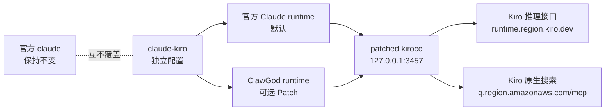
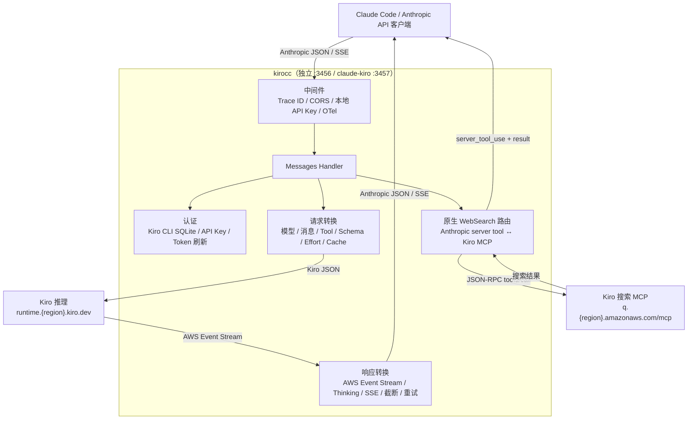

# ClaudeCode Kiro

[English](README_EN.md) · [变更记录](CHANGELOG.md) · [参与贡献](CONTRIBUTING.md) · [Releases](https://github.com/itututu/claudecode-kiro/releases) · [上游 kirocc](https://github.com/d-kuro/kirocc) · [ClawGod](https://github.com/0Chencc/clawgod) · [Telegram 交流群](https://t.me/+y-jOB2WmYGo2YjQ1)

[](https://github.com/itututu/claudecode-kiro/actions/workflows/ci.yml)
[](LICENSE)
[](https://github.com/0Chencc/clawgod/releases/tag/v1.7.5)

这是一个公开、可审计的 Claude Code + Kiro CLI 集成版本，ClawGod 为显式
可选组件。它在 kirocc 基础上补齐 Kiro 原生 WebSearch，并通过独立的
`claude-kiro` 命令运行，不覆盖官方 `claude` 命令。默认直接使用官方 Claude
Code runtime；只有用户主动选择时才安装 ClawGod。

> 本项目与 Anthropic、Amazon、Kiro、d-kuro、ClawGod 均无隶属关系。
> 仓库不包含 Claude Code 二进制、提取源码、私有内置系统提示词、账号凭据、
> 会话历史或本机生成的 ClawGod runtime。

## 下载与 Releases

[当前预发行版 `v0.6.0-clawgod.2`](https://github.com/itututu/claudecode-kiro/releases/tag/v0.6.0-clawgod.2)
已经发布。仓库继承了上游 kirocc `v0.6.0` 及更早的版本线，因此本项目不会把
这些上游 Tag 重新包装成自己的 Release。

本项目使用独立版本号 `v<上游版本>-clawgod.<本项目序号>`。首个预发行版为
`v0.6.0-clawgod.1`，当前版本详见[中文优先的发布说明](docs/release-notes/v0.6.0-clawgod.2.md)。
受管理的完整配置请始终按下文从源码安装。

需要注意 Release 的制品边界：

- Windows ZIP、macOS/Linux tar.gz 只包含独立 `kirocc` 网关及公开文档。
- Release 不包含 Claude Code、ClawGod 生成文件、凭据、会话或完整
  `claude-kiro` 安装目录。
- 需要受管理的 `claude-kiro`、隔离配置或可选 ClawGod 时，仍需克隆源码并
  运行 `scripts/install.sh` 或 `scripts/install.ps1`。
- Release 发布状态和构建日志以 [GitHub Actions](https://github.com/itututu/claudecode-kiro/actions)
  为准；不要使用来源不明的二进制包。

## 交流群

安装交流和版本反馈：[加入 Telegram 交流群](https://t.me/+y-jOB2WmYGo2YjQ1)。
请勿在群内发送 Kiro 凭据、API Token、Provider 文件或 Claude 会话日志。

## 文档导航

- [下载与 Releases](#下载与-releases)
- [问题背景](#解决的问题)和[版本对比](#版本对比图)
- [可选 ClawGod 功能](#可选的-clawgod-功能)和[提示词行为](#clawgod-内置提示词能否继续使用)
- [安装、验证、更新和卸载](#安装与生命周期)
- [主要功能](#主要功能)、[仅安装网关](#仅安装网关)和[使用方式](#使用方式)
- [API](#api-endpoint)、[架构](#架构)和功能原理
- [已知边界](#已知边界)、[排障](#排障)、[安全](#安全与数据处理)和[测试](#测试与验证状态)

## 解决的问题

Claude Code 内置 WebSearch 会发送 Anthropic server tool：

```json
{
  "tools": [
    {
      "max_uses": 8,
      "type": "web_search_20250305",
      "name": "web_search"
    }
  ],
  "tool_choice": {"type": "tool", "name": "web_search"}
}
```

上游 kirocc v0.6.0 会把它当成普通客户端工具发送到 Kiro 推理接口，最终出现
`TOOL_SCHEMA_INVALID`/502。本版本改为直接调用 Kiro 原生 MCP：

```text
https://q.<region>.amazonaws.com/mcp
```

并返回 Claude Code 能识别的：

- `server_tool_use`
- 带相同 `tool_use_id` 的 `web_search_tool_result`
- `web_search_result`
- 非流式 JSON 与完整 SSE 流式事件
- `usage.server_tool_use.web_search_requests`
- 403 凭据刷新以及 429/5xx 重试

## 版本对比图

验证快照：Claude Code 2.1.220、ClawGod 1.7.5、kirocc 0.6.0、Kiro CLI
2.16.0、macOS arm64，日期 2026-08-03。

最后一列表示显式选择 `--with-clawgod` 后的完整 Patch 配置。默认安装仍包含
Kiro、原生 WebSearch 和配置隔离，但不应用任何 ClawGod Patch。


| 能力 | 官方 Claude Code | 仅 ClawGod | 上游 kirocc 0.6.0 | 我们的 ClaudeCode Kiro |
| --- | :---: | :---: | :---: | :---: |
| Claude Code 原生工具和运行时 | ✅ | ✅ 已 Patch | ✅ 经协议适配 | ✅ 默认官方 / 可选 Patch |
| 使用 Kiro CLI 订阅/凭据 | — | — | ✅ | ✅ |
| 原生 effort/扩展思考 | 取决于官方账号 | 取决于 Provider | ✅ | ✅ |
| Anthropic Tool Search 模拟 | 取决于官方接口 | 取决于 Provider | ✅ | ✅ |
| 内置 WebSearch 走 Kiro MCP | — | — | ❌ 502 | ✅ |
| WebSearch 非流式与 SSE 流式 | 官方支持 | 取决于 Provider | ❌ | ✅ |
| Windows 11 x64 原生受管理配置 | ✅ | ✅ | 仅手工网关 | ✅ |
| 单独命令、配置和端口 | 官方配置 | 默认会替换/别名启动器 | 需手工配置 | ✅ |
| 本安装器不改官方 `claude` 路径 | ✅ | ❌ 默认安装行为 | ✅ | ✅ |
| DuckDuckGo 等搜索 MCP 作为备用 | 手工 | 手工 | 手工 | ✅ 可共存 |
| ClawGod 客户端功能解锁和限制移除 Patch | — | ✅ | — | ✅ 可选 |
| 绕过服务端额度、鉴权、计费或模型权限 | ❌ | ❌ | ❌ | ❌ |



## 可选的 ClawGod 功能

使用 `--with-clawgod`（Windows 为 `-WithClawGod`）才会安装锁定的 ClawGod
v1.7.5 runtime patch，并关闭 Lean 模式。未选择该参数时，`claude-kiro`
直接使用官方 Claude Code runtime，本节所有 Patch 均不会应用。

| ClawGod Patch 类别 | `claude-kiro` 中包含的能力 |
| --- | --- |
| 功能解锁 | Internal User Mode 和隐藏命令、GrowthBook 功能旗标覆盖、Agent Teams、第三方 Provider Auto-mode，以及 Computer Use、Ultraplan、Ultrareview 的客户端入口解锁 |
| 限制移除 | 移除 ClawGod 文档列出的客户端安全测试拒绝提示、URL 生成限制、谨慎操作强制确认和未登录提示 |
| 地区检测中和 | 中和其文档列出的时区/代理/Base URL 地区探针和 Unicode 撇号选择器 |
| 视觉 Patch | 绿色 ClawGod 品牌色表示正在运行 Patch 版本；消息过滤 Patch 会显示原本对非 Anthropic Provider 隐藏的内容 |
| 可靠性 Patch | Bun runtime 下恢复 Glob/Grep、启用 1 小时 Prompt Cache allowlist、修复第三方 Provider billing header 导致的缓存命中问题 |
| Lean 设置 | 明确设为 `off`；不会由 Lean 模式删除 Plan mode、Agent Teams、内置 Skills、Workflows、Remote Control 或 Artifact |

仓库有意不提交 ClawGod Patch 本体、生成的 `cli.cjs` 或提取出的 Claude Code
源码。[`scripts/install.sh`](scripts/install.sh) 会下载锁定的 v1.7.5 installer、
校验 SHA-256、只在临时目录加入隔离路径覆盖，然后在用户本机生成 runtime。
因此 GitHub 显示的是可审计的集成和隔离代码，生成运行时不会进入 Git。

这里的“解锁”或“绕过限制”指修改本地 Claude Code 客户端中的检查、功能旗标或
注入提示，**不代表**可以增加 Kiro/Anthropic 服务端额度，也不能绕过服务端鉴权、
计费、限流、订阅校验、地区服务可用性或模型权限。Computer Use 和依赖 Remote
的功能仍取决于本机平台及所用后端。移除谨慎操作提示也不等于获得执行破坏性或
未授权操作的许可，运行命令前仍需自行确认。

与原版 ClawGod 不同，本项目不会替换官方 `claude` 启动器，并禁止
`claude-kiro update` 原地更新，以防破坏隔离路径和校验边界。更新请运行：

```bash
./scripts/install.sh --refresh-clawgod
```

## ClawGod 内置提示词能否继续使用

选择 ClawGod 后可以。ClawGod 仍然运行 Claude Code 自带的系统提示链和 runtime patch；KiroCC
只替换 Anthropic API 的后端地址，不会移除这条提示链。

但官方 Claude Code 内置系统提示词属于专有内容，本仓库不会把从 `cli.cjs` 中
提取出的提示词复制到 GitHub。公开版使用原创、可审计的
[`config/CLAUDE.md`](config/CLAUDE.md) 作为附加提示，负责：

- 优先使用 Kiro 原生 WebSearch
- 搜索答案提供来源链接
- 搜索失败时允许显式配置的 MCP 备用
- 保护官方 Claude Code 安装和更新边界
- 禁止提交凭据、Provider 文件和会话历史
- 要求测试和诚实报告真实联网验收边界

这份 `CLAUDE.md` 是附加规则，不冒充、复制或替换官方内置提示词。

## 安装与生命周期

### 依赖

- macOS、Linux，或原生 Windows 11 x64
- Go 1.26.1+、Node.js 18+
- 一种可用的 Kiro 上游凭据：Kiro CLI 登录数据库，或 Kiro API Key 和 Region
- 官方 Claude Code（只在用户本机使用，不会进入仓库）
- macOS/Linux 需要 curl
- 只有选择 ClawGod 时才需要 Bun 1.3.14+、ripgrep，以及 `shasum` 或 `sha256sum` 之一
- 用户级 `.local/bin` 已加入 `PATH`（Windows 安装器会自动加入）

Kiro CLI 的原生 Windows 版本当前面向 Windows 11 x64。单独的 KiroCC
二进制可能能在更多系统运行，但这不等于完整认证配置已得到支持。

Kiro CLI **不是请求流量的中转程序**。数据库模式只借它完成登录并生成本地
凭据；实际对话和 WebSearch 请求始终由 `kirocc` 网关直接发往 Kiro。已有登录
数据库时，即使 `kiro-cli` 命令后来被移除，网关仍可继续读取和刷新凭据；但
重新登录或修复账号时仍需 Kiro CLI。

### 先准备 Kiro 认证

选择以下一种模式。使用 Kiro CLI 数据库时，先安装并登录：

macOS/Linux：

```bash
curl -fsSL https://cli.kiro.dev/install | bash
kiro-cli login
kiro-cli whoami
```

Windows 11 PowerShell：

```powershell
irm 'https://cli.kiro.dev/install.ps1' | iex
kiro-cli login
kiro-cli whoami
```

浏览器登录不方便时可运行 `kiro-cli login --use-device-flow`。详见 Kiro 官方的
[安装说明](https://kiro.dev/docs/cli/installation/)和
[认证说明](https://kiro.dev/docs/cli/authentication/)。

不想安装 Kiro CLI 时，改用 API Key。安装和每次启动 `claude-kiro` 的进程都
必须能读到这些变量；本项目不会把 Key 写入仓库或启动器：

```bash
export KIRO_API_KEY=ksk_...
export KIRO_API_REGION=us-east-1
./scripts/install.sh
claude-kiro
```

```powershell
$env:KIRO_API_KEY = "ksk_..."
$env:KIRO_API_REGION = "us-east-1"
powershell.exe -NoProfile -ExecutionPolicy Bypass -File .\scripts\install.ps1
claude-kiro
```

### 默认安装：官方 Claude Code runtime

macOS/Linux：

```bash
git clone https://github.com/itututu/claudecode-kiro.git
cd claudecode-kiro
./scripts/install.sh
claude-kiro
```

Windows PowerShell：

```powershell
git clone https://github.com/itututu/claudecode-kiro.git
Set-Location claudecode-kiro
powershell.exe -NoProfile -ExecutionPolicy Bypass -File .\scripts\install.ps1
claude-kiro
```

默认安装器只编译 KiroCC 网关，并围绕本机已有的官方 Claude Code 创建独立
`claude-kiro` 配置；不会下载 ClawGod，也不会创建、替换、重命名或删除官方
`claude` 命令。安装器会先确认 `KIRO_API_KEY` 或现有登录数据库至少有一个；
缺少凭据时会在构建前停止，并给出官方 Kiro CLI 安装/登录命令，不会留下一个
首次运行必然 401 的安装结果。

### 可选安装 ClawGod

macOS/Linux：

```bash
./scripts/install.sh --with-clawgod
```

Windows PowerShell：

```powershell
powershell.exe -NoProfile -ExecutionPolicy Bypass -File .\scripts\install.ps1 -WithClawGod
```

选择后安装器会：

1. 编译带原生 WebSearch 的 kirocc。
2. 下载锁定的 ClawGod v1.7.5 installer。
3. 校验 installer SHA-256：
   `4a943439ae8cb858e69279d19f0d3a979968fc0a9e4c42e1d1018ae76657ce82`。
4. 仅在临时目录给 installer 增加隔离路径参数。
5. 把生成的 ClawGod runtime 放入独立目录。
6. 创建独立状态、Claude 配置和 `claude-kiro` 启动器。

Windows `install.ps1` 的锁定 SHA-256 为
`bf2a9947f5f5747ceaf0ebc77f8f0c66887a2c390e7e996c28b6c72b5b579d3e`。
两个平台都只修改临时下载的安装器副本，不把生成 runtime 提交到 Git。

### 安装目录

| 用途 | macOS/Linux | Windows |
| --- | --- | --- |
| 独立启动器 | `~/.local/bin/claude-kiro` | `%USERPROFILE%\.local\bin\claude-kiro.cmd` |
| KiroCC 网关 | `~/.local/share/clawgod-kirocc/bin/kirocc-native-websearch` | `%LOCALAPPDATA%\ClawGodKiroCC\clawgod-kirocc\bin\kirocc-native-websearch.exe` |
| 可选 ClawGod | `~/.local/share/clawgod-kirocc/clawgod/` | `%LOCALAPPDATA%\ClawGodKiroCC\clawgod-kirocc\clawgod\` |
| 独立状态 | `~/.clawgod-kirocc/` | `%USERPROFILE%\.clawgod-kirocc\` |
| Claude 配置 | `~/.clawgod-kirocc/claude-config/` | `%USERPROFILE%\.clawgod-kirocc\claude-config\` |
| 网关日志 | `${TMPDIR:-/tmp}/clawgod-kirocc-gateway-*` | `%TEMP%\clawgod-kirocc-gateway-*` |

`claude-kiro` 管理的默认端口为 `3457`；单独运行 `kirocc` 的默认端口为
`3456`。如果 `KIROCC_URL` 已有健康网关，启动器会直接复用；否则会启动一个
子进程，并在 `claude-kiro` 退出时清理该子进程。

### 验证安装与隔离

macOS/Linux：

```bash
./scripts/doctor.sh
command -v claude
command -v claude-kiro
claude --version
claude-kiro --version
```

Windows PowerShell：

```powershell
.\scripts\doctor.ps1
Get-Command claude
Get-Command claude-kiro
claude --version
claude-kiro --version
```

诊断脚本完全只读：不会输出凭据、修改配置、启动 Claude Code，也不会启停网关。
`claude-kiro` 关闭时出现“网关不可达”警告属于正常情况。自动化环境若希望任何
警告都返回非零状态，可使用 `./scripts/doctor.sh --strict`。

两个命令路径必须不同。默认模式下二者都使用官方 runtime，但只有
`claude-kiro` 使用 Kiro 后端和独立配置；绿色品牌色只在选择 ClawGod 后出现。
`--version` 很快退出，
启动器也会同步关闭临时网关；仅在交互会话打开期间检查：

```bash
curl http://127.0.0.1:3457/health
```

### 安装参数和覆盖变量

```text
./scripts/install.sh [--with-clawgod] [--refresh-clawgod] [--gateway-only]
.\scripts\install.ps1 [-WithClawGod] [-RefreshClawGod] [-GatewayOnly]
```

| 参数或变量 | 作用 |
| --- | --- |
| `--with-clawgod` / `-WithClawGod` | 显式选择锁定的隔离 ClawGod runtime |
| `--refresh-clawgod` / `-RefreshClawGod` | 重新生成并自动选择 ClawGod |
| `--gateway-only` / `-GatewayOnly` | 兼容旧高级用法，围绕显式 `CLAWGOD_BIN` 安装并自动选择 ClawGod |
| `CLAWGOD_BIN` | gateway-only 模式使用的现有 ClawGod 启动器 |
| `CLAWGOD_RELEASE` | ClawGod Release Tag，默认 `v1.7.5` |
| `CLAWGOD_INSTALLER_SHA256` | 更换 Release 时必须提供的预期校验值 |
| `CLAUDE_KIRO_RUNTIME_BIN` | 覆盖 `claude-kiro` 使用的官方或 Patch runtime |
| `CLAWGOD_KIROCC_INSTALL_ROOT` | runtime 根目录，使用上表所示 OS 默认值 |
| `CLAWGOD_KIROCC_STATE_ROOT` | 状态根目录，默认 `~/.clawgod-kirocc` |
| `CLAWGOD_KIROCC_BIN_DIR` | 启动器目录，默认 `~/.local/bin` |
| `KIROCC_PORT` | 启动器管理的网关端口，默认 `3457` |

如果已有独立 ClawGod：

```bash
CLAWGOD_BIN=/绝对路径/clawgod ./scripts/install.sh --gateway-only
```

### 更新与卸载

`claude-kiro update` 被有意禁用，防止上游自更新绕开校验和隔离边界。更新方式：

```bash
git pull --ff-only
./scripts/install.sh                    # 默认官方 runtime
./scripts/install.sh --refresh-clawgod # 已选择 ClawGod
```

Windows PowerShell：

```powershell
git pull --ff-only
powershell.exe -NoProfile -ExecutionPolicy Bypass -File .\scripts\install.ps1
powershell.exe -NoProfile -ExecutionPolicy Bypass -File .\scripts\install.ps1 -RefreshClawGod
```

只有当前选择 ClawGod runtime 时才运行最后一条。

卸载但保留配置和会话状态：

```bash
./scripts/uninstall.sh
```

同时删除独立状态：

```bash
./scripts/uninstall.sh --purge-state
```

Windows 对应命令为 `.\scripts\uninstall.ps1` 和
`.\scripts\uninstall.ps1 -PurgeState`。

## 主要功能

- **Anthropic Messages API 兼容**：支持 `/v1/messages`（流式/非流式）、`/v1/messages/count_tokens` 和 `/v1/models`。
- **请求/响应协议转换**：Anthropic JSON/SSE 与 Kiro JSON/AWS Event Stream 双向转换。
- **自动认证管理**：读取 Kiro CLI SQLite 凭据并自动刷新 Social/OIDC Token，也支持 Kiro API Key。
- **模型映射**：将 Anthropic 风格模型名映射为 Kiro SKU，可通过环境变量覆盖。
- **扩展思考**：支持 `[1m]`、`thinking` 和 `output_config.effort`，原生转发并按模型枚举校验/收敛 effort。
- **Tool Search**：在代理侧实现 regex/BM25 Tool Search 和 `defer_loading` 按需工具发现。
- **Kiro 原生 WebSearch**：把 `web_search_20250305` 映射到 Kiro MCP，支持 JSON、SSE、重试、Token Count 和 server-tool usage。
- **隔离 runtime 配置**：默认围绕官方 Claude Code 提供独立命令、状态、配置、网关、端口和更新边界；ClawGod 为显式可选，不修改官方 `claude`。
- **Prompt Cache**：把 Anthropic 工具级 `cache_control` 转换为 Kiro `cachePoint`。
- **截断检测与重试**：记录截断结果；对 403、429、5xx 和仅含 thinking 的空可见响应重试。
- **SSE Keep-alive**：默认每 15 秒为长时间无输出的流发送注释心跳。
- **本地代理鉴权/CORS**：可设置代理 API Key，并允许 localhost 来源。
- **日志与 OpenTelemetry**：支持轮转 JSON Lines 日志和 OTLP HTTP 全链路追踪。

## 仅安装网关

如果只需要 Anthropic → Kiro 网关，不需要受管理的 `claude-kiro` 配置：

```bash
git clone https://github.com/itututu/claudecode-kiro.git
cd claudecode-kiro
GOEXPERIMENT=jsonv2 go build -trimpath -o ./dist/kirocc ./cmd/kirocc
```

Go module 路径保留为 `github.com/d-kuro/kirocc`，用于兼容上游和保留归属。
请使用上述源码构建或 Release 二进制，不要对 Fork URL 直接执行 `go install`。

## 使用方式

### 使用隔离的 `claude-kiro`

```bash
claude-kiro
```

启动器会设置独立 `CLAUDE_CONFIG_DIR`，把 `ANTHROPIC_BASE_URL` 指向本地网关，
清除可能冲突的 Anthropic/Bedrock/Vertex/Foundry Provider 变量，然后把全部参数
转交给已选择的 runtime：默认是官方 Claude Code，显式安装后才是 ClawGod。

运行时覆盖变量：

| 变量 | 作用 |
| --- | --- |
| `KIROCC_BIN` | 指定另一个带 Patch 的网关二进制 |
| `CLAUDE_KIRO_RUNTIME_BIN` | 指定另一个官方或 Patch runtime |
| `CLAWGOD_BIN` | 指定 ClawGod runtime 的兼容别名 |
| `CLAUDE_KIRO_CONFIG_DIR` / `CLAWGOD_KIROCC_CONFIG_DIR` | 指定另一个独立 Claude 配置目录 |
| `KIROCC_PORT` | 启动器自行启动网关时使用的端口 |
| `KIROCC_URL` | 复用已有网关 URL，替代默认 `http://127.0.0.1:$KIROCC_PORT` |
| `KIROCC_API_KEY` | 保护本地网关，并作为 Claude 访问本地代理的 Token |
| `KIRO_API_REGION` | 固定 Kiro 推理/MCP 区域；启动器默认 `us-east-1`，可改为 `eu-central-1` |
| `CLAUDE_KIRO_PRESERVE_PROXY=1` | 不清除 Claude Code 子进程的 HTTP(S) 代理变量；仅当 `KIROCC_URL` 不是本机网关时使用 |

### 单独启动网关

```bash
./dist/kirocc
```

默认监听 `http://127.0.0.1:3456`。让官方 Claude Code 或其他 Anthropic
Messages API 客户端使用这个网关：

```bash
export ANTHROPIC_BASE_URL=http://127.0.0.1:3456
export ANTHROPIC_AUTH_TOKEN=dummy
claude
```

未设置 `-api-key`/`KIROCC_API_KEY` 时，`ANTHROPIC_AUTH_TOKEN` 只需非空；
kirocc 的上游凭据来自 Kiro CLI 数据库或 `KIRO_API_KEY`。

### Kiro 认证模式

网关支持两种互斥的上游凭据来源：

1. **Kiro CLI 数据库（默认）**：读取系统对应的 SQLite 数据库并自动刷新
   Social/OIDC 凭据。
2. **Kiro API Key**：设置 `KIRO_API_KEY=ksk_...`，可选
   `KIRO_API_REGION`；也可使用 `-kiro-api-key` 和
   `-kiro-api-region`。这只是不读取本地 Kiro CLI 数据库，并不绕过 Kiro
   服务端鉴权或额度。

`KIRO_API_REGION` 是两种认证模式共用的网络路由覆盖项。Kiro CLI 数据库中的
Region 可能只是登录区域，并不一定存在 Kiro 推理服务；受管理的
`claude-kiro` 启动器因此默认把推理和 MCP 固定到 `us-east-1`，但 Token
刷新仍使用凭据原始区域。欧洲用户可以在启动前设置
`KIRO_API_REGION=eu-central-1`。单独运行网关且未设置该变量时，仍沿用凭据区域。

`KIROCC_API_KEY` 是本地代理访问密码，不是 Kiro 凭据。

数据路径如下；`kiro-cli` 不在逐请求链路中：

```text
Claude Code ──Anthropic API──> 127.0.0.1:3457 (kirocc)
                                      │
                         读取数据库或 KIRO_API_KEY
                                      │
                                      └──> Kiro Messages API / Kiro MCP
```

网关直接完成请求转换、上游发送和凭据刷新。原生 WebSearch 也是网关直接调用
Kiro MCP，并非启动 `kiro-cli` 子进程。

### 命令行选项

| 选项 | 默认值 | 说明 |
| --- | --- | --- |
| `-port` | `3456` | 监听端口 |
| `-host` | `127.0.0.1` | 绑定地址 |
| `-db` | 见下表 | Kiro CLI SQLite 数据库路径 |
| `-api-key` | 空 | 访问本地代理所需的 API Key |
| `-kiro-api-key` | 空 | 替代 Kiro CLI 数据库的 `ksk_...` Key |
| `-kiro-api-region` | 空 | 固定 Kiro 推理/MCP Region；覆盖凭据中的登录区域 |
| `-debug` | `false` | 启用 Debug 日志 |
| `-keepalive-interval` | `15s` | SSE 空闲心跳间隔；`0` 表示关闭 |
| `-log-file` | 空 | 写入带轮转的日志文件 |
| `-log-max-size` | `10` | 单个日志文件最大 MB |
| `-log-max-backups` | `5` | 最大备份文件数量 |
| `-log-max-age` | `7` | 日志最大保留天数 |
| `-log-compress` | `false` | gzip 压缩轮转日志 |
| `-log-console` | `false` | 设置日志文件时同时输出控制台 |
| `-otel` | `false` | 启用 OTLP HTTP OpenTelemetry |
| `-otel-body-limit` | `32768` | Span 捕获请求正文的最大字节数；`0` 不限制 |

Kiro CLI 默认数据库：

| 系统 | 路径 |
| --- | --- |
| macOS | `~/Library/Application Support/kiro-cli/data.sqlite3` |
| Linux | `~/.local/share/kiro-cli/data.sqlite3` |
| Windows | `%USERPROFILE%\.local\share\kiro-cli\data.sqlite3`；启动器还会探测 `%LOCALAPPDATA%` 和 `%APPDATA%` |

### 网关环境变量

| 变量 | 对应选项/用途 |
| --- | --- |
| `KIROCC_PORT` | `-port` |
| `KIROCC_HOST` | `-host` |
| `KIROCC_DB_PATH` | `-db` |
| `KIROCC_API_KEY` | `-api-key` |
| `KIRO_API_KEY` | `-kiro-api-key` |
| `KIRO_API_REGION` | `-kiro-api-region` |
| `KIROCC_DEBUG` | `-debug` |
| `KIROCC_KEEPALIVE_INTERVAL` | `-keepalive-interval` |
| `KIROCC_LOG_FILE` | `-log-file` |
| `KIROCC_LOG_MAX_SIZE` | `-log-max-size` |
| `KIROCC_LOG_MAX_BACKUPS` | `-log-max-backups` |
| `KIROCC_LOG_MAX_AGE` | `-log-max-age` |
| `KIROCC_LOG_COMPRESS` | `-log-compress` |
| `KIROCC_LOG_CONSOLE` | `-log-console` |
| `KIROCC_OTEL` | `-otel` |
| `KIROCC_OTEL_BODY_LIMIT` | `-otel-body-limit` |
| `KIROCC_MODEL_MAPPINGS` | 自定义模型映射 JSON，无对应 Flag |

### OpenTelemetry

```bash
docker run -d --name lgtm -p 3000:3000 -p 4317:4317 -p 4318:4318 grafana/otel-lgtm
./dist/kirocc -otel
```

默认 OTLP Endpoint 为 `http://localhost:4318`，可通过标准变量
`OTEL_EXPORTER_OTLP_ENDPOINT` 修改。Span 可能包含代码和请求正文，注意保密。

### 自定义模型映射

```bash
export KIROCC_MODEL_MAPPINGS='[{"anthropic":"my-model","kiro":"claude-sonnet-4.5","context_window_size":200000}]'
```

## API Endpoint

| 路径 | 说明 |
| --- | --- |
| `GET /health` | 健康检查；不要求本地代理 API Key |
| `GET /v1/models` | 返回模型列表 |
| `POST /v1/messages` | Messages API，支持流式/非流式 |
| `POST /v1/messages/count_tokens` | 近似 Token Count |

`count_tokens` 使用 [tiktoken-go](https://github.com/pkoukk/tiktoken-go) 的
`cl100k_base`，与 Claude 实际 Tokenizer 不同，结果仅为近似值。

## 架构



### 请求流程

1. 客户端向 `/v1/messages` 发送 Anthropic Messages API 请求。
2. 中间件分配 Trace ID、处理 CORS、验证本地代理 API Key。
3. 认证层读取/刷新 Kiro CLI 凭据，或使用显式 Kiro API Key。
4. Handler 解析模型、上下文窗口和 Thinking/Effort。
5. 如果请求只含一个 `web_search_20250305` server tool，则提取查询并直接走
   Kiro MCP；不会进入 Kiro 推理 Endpoint。
6. 其他请求进入推理转换链：
   - 合并连续同角色消息，解析文本、图片、`tool_use`、`tool_result`。
   - 转换 Tool 并清理 JSON Schema，处理 `anyOf`/`oneOf`/`allOf`。
   - 拆分 active/deferred 工具并注入代理侧 `ToolSearch`。
   - 把系统提示转换为历史消息对，解析 `<env>` 中的系统和工作目录。
   - 按前一个 Assistant Tool 调用顺序重排 Tool Result。
   - 转发并按模型校验 `output_config.effort`。
   - 把工具级 `cache_control` 转换成 Kiro `cachePoint`。
7. Kiro 推理接口返回二进制 AWS Event Stream。
8. 响应链解析帧、生成增量文本、处理 Thinking、Tool Search 内循环、
   `stop_sequences`/`max_tokens`、截断和空可见响应重试，最终输出 JSON/SSE。

### Kiro 原生 WebSearch

当前支持 Claude Code 的原生调用形式：`tools` 数组只包含一个
`web_search_20250305` server tool。网关会：

1. 从最后一条用户消息提取查询。
2. 向 Kiro 区域 MCP 发送 JSON-RPC `tools/call`，Tool 名为 `web_search`。
3. 遇到 403 刷新凭据，对 429/5xx 退避重试。
4. 在 `server_tool_use` 和 `web_search_tool_result` 中使用相同
   `tool_use_id`。
5. 支持非流式 JSON、有序 SSE、Token Count 和
   `usage.server_tool_use.web_search_requests`。

手工把原生 WebSearch 与其他客户端 Tool 放在同一次请求中会明确返回 HTTP
400。Claude Code 已观察到的内置 WebSearch 子请求使用受支持的单 server-tool
形式。搜索可用性、排序、时效性和订阅校验仍由 Kiro 上游决定。

### 扩展思考与 Effort

kirocc 把 reasoning depth 放在请求根部的
`additionalModelRequestFields.output_config.effort`：

```json
{
  "conversationState": {"...": "..."},
  "additionalModelRequestFields": {
    "output_config": {"effort": "medium"}
  }
}
```

Thinking 可由以下方式启用：

- Sonnet 4.x 等模型名带 `[1m]` 后缀。
- `Anthropic-Beta` Header 包含 `context-1m`。
- 请求中的 `thinking.type` 为 `"enabled"` 或 `"adaptive"`。

Effort 解析规则：

1. 识别到显式 `output_config.effort` 时优先使用，并按模型允许枚举校验；
   不支持 `xhigh` 的模型会收敛为 `max`，未知值会丢弃。
2. 已启用 Thinking 但没有显式 Effort 时，支持 Effort 的模型默认发送
   `medium`。
3. 否则不发送该字段。

允许的级别：

- `claude-opus-5.5`、`claude-sonnet-5.5`、`claude-opus-5`、`claude-sonnet-5`、`claude-opus-4.8`、`claude-opus-4.7`：
  `low`、`medium`、`high`、`xhigh`、`max`。
- `claude-opus-4.6`、`claude-sonnet-4.6`：
  `low`、`medium`、`high`、`max`。
- 其他模型（`claude-sonnet-4.5`、`claude-opus-4.5`、`claude-haiku-4.5`、`claude-sonnet-4`
  及旧版 `-1m` SKU）不发送 `additionalModelRequestFields`。

以上枚举已对照 kiro-cli 2.27.1 模型目录重新验证。

`thinking.budget_tokens` 会被接受，但 reasoning depth 完全由 Effort 表达。
对于始终 1M 的 Opus 5.5、Sonnet 5.5、Opus 5、Sonnet 5、Opus 4.6/4.7/4.8 和 Sonnet 4.6，请求模型名中的 `[1m]`
只是上下文窗口别名，不会单独启用 Thinking。

### Tool Search

Kiro 推理后端不原生支持 Anthropic Tool Search，因此由网关实现内循环：

1. 客户端发送 `tool_search_tool_regex_20251119` 或 BM25 Tool，并把部分工具
   标为 `defer_loading: true`。
2. 网关只把 active Tool 发送给 Kiro，把 deferred Tool 留在本地索引。
3. 网关注入 Kiro 能理解的 `ToolSearch` Tool。
4. 模型调用 `ToolSearch` 时，网关执行 regex/BM25，发出
   `server_tool_use` + `tool_search_tool_result`，提升命中的 Tool 后重新请求
   Kiro，最多 3 轮。
5. 模型调用普通 Tool 或输出文本时结束内循环并转发。

查询形式：

- `select:Read,Edit,Grep`：按名称精确选择 Tool。
- `read file`：关键词搜索，regex 使用词级 OR fallback，或使用 BM25 评分。

### 模型映射

| 输入模型 | Kiro 模型 | 上下文窗口 |
| --- | --- | --- |
| `claude-opus-5-5` | `claude-opus-5.5` | 1M |
| `claude-opus-5-5[1m]` | `claude-opus-5.5` | 1M |
| `claude-sonnet-5-5` | `claude-sonnet-5.5` | 1M |
| `claude-sonnet-5-5[1m]` | `claude-sonnet-5.5` | 1M |
| `claude-opus-5` | `claude-opus-5` | 1M |
| `claude-opus-5[1m]` | `claude-opus-5` | 1M |
| `claude-sonnet-5` | `claude-sonnet-5` | 1M |
| `claude-sonnet-5[1m]` | `claude-sonnet-5` | 1M |
| `claude-sonnet-4-6` | `claude-sonnet-4.6` | 1M |
| `claude-sonnet-4-6[1m]` | `claude-sonnet-4.6` | 1M |
| `claude-sonnet-4-5` | `claude-sonnet-4.5` | 200k |
| `claude-opus-4-8` | `claude-opus-4.8` | 1M |
| `claude-opus-4-8[1m]` | `claude-opus-4.8` | 1M |
| `claude-opus-4-7` | `claude-opus-4.7` | 1M |
| `claude-opus-4-7[1m]` | `claude-opus-4.7` | 1M |
| `claude-opus-4-6` | `claude-opus-4.6` | 1M |
| `claude-opus-4-6[1m]` | `claude-opus-4.6` | 1M |
| `claude-opus-4-5` | `claude-opus-4.5` | 200k |
| `claude-haiku-4-5` | `claude-haiku-4.5` | 200k |

带日期的快照 ID（如 `claude-haiku-4-5-20251001`）会解析为不带日期的别名，
也接受点号形式的 Kiro ID（如 `claude-haiku-4.5`）。没有匹配的 `claude-*` 模型
会去掉日期后缀后原样传递；非 Claude 模型 fallback 到 `claude-sonnet-4.6`。
旧版 `-1m` SKU 不接受 Effort（`claude-sonnet-4.5-1m` 已下线），网关不再路由到它们；
Sonnet 4.5 仅 200k。Opus 5.5、Sonnet 5.5、Opus 5、Sonnet 5、Opus 4.6/4.7/4.8 和 Sonnet 4.6 只有 1M SKU；响应模型名
会保留/补充 `[1m]`，让 Claude Code 正确识别 1M 上下文，避免按 200k 提前
自动压缩。响应中的 `[1m]` 只用于声明上下文窗口，不代表已启用 Thinking。

## 已知边界

- Windows 原生支持面向 Windows 11 x64。CI 会解析 PowerShell、运行 Windows
  Go 测试并构建 PE 文件，但带真实凭据的 Windows 全新安装 E2E 仍取决于环境。
- 原生 WebSearch 与其他客户端 Tool 混合的手工请求返回 HTTP 400。
- `count_tokens` 是近似值，不等同 Claude 官方 Tokenizer。
- Computer Use、Ultraplan、Ultrareview 等入口虽然被 ClawGod 解锁，实际能力仍
  依赖操作系统、Native Module、远端服务和 Kiro 后端兼容性。
- Kiro 订阅、模型权限、限流、地区可用性、搜索质量和时效性均由上游决定。
- ClawGod 原地更新被禁用；必须通过本仓库安装器更新。
- 自动测试验证协议和错误路径，但不能证明任意时刻的 Kiro 服务可用性。

## 排障

| 现象 | 检查或处理 |
| --- | --- |
| `claude-kiro: command not found` | 把用户 `.local/bin` 加入 `PATH`；Windows 安装后请打开新终端 |
| `go.exe: unknown GOEXPERIMENT jsonv2` | 当前 `go.exe` 低于项目要求；运行 `winget upgrade --id GoLang.Go -e`，打开新 PowerShell，以 `where.exe go` 和 `go version` 确认已使用 Go 1.26.1+ |
| 安装器提示缺少依赖 | 默认模式需要 Go/Node，macOS/Linux 另需 curl；只有 ClawGod 模式需要 Bun/ripgrep/SHA-256 工具 |
| `No usable Kiro credential source found` | 运行错误中给出的 Kiro CLI 安装命令，再执行 `kiro-cli login` 和 `kiro-cli whoami`；或在安装及启动时设置 `KIRO_API_KEY`/`KIRO_API_REGION` |
| 找不到官方 Claude Code | 先确认 `command -v claude` 有结果，再重新安装 |
| 网关启动失败 | 查看 `${TMPDIR:-/tmp}/clawgod-kirocc-gateway-$UID-${KIROCC_PORT:-3457}.log`；端口冲突时使用 `KIROCC_PORT=3458` |
| `authentication failed` 或 Kiro 返回 401/403 | 这是上游 Kiro 凭据问题：重新执行 `kiro-cli login`/`kiro-cli whoami`，或检查 `KIRO_API_KEY`/`KIRO_API_REGION` |
| `/model` 后返回无正文 502 | 拉取最新版并重跑安装器；启动器会默认使用 `us-east-1`。仍失败时先确认 `kiro-cli chat --list-models` 包含目标模型，再尝试 `$env:KIRO_API_REGION='eu-central-1'; claude-kiro`（PowerShell） |
| 手工请求本地网关成功，但 Claude Code 502/卡住且网关没有 POST 日志 | Windows/macOS/Linux 的 `HTTP_PROXY`/`HTTPS_PROXY` 可能接管了 loopback 请求；最新版启动器会让网关保留代理访问 Kiro，同时只为 Claude Code 子进程清除代理变量。更新后重跑安装器 |
| `invalid API key` / 已运行网关拒绝 `KIROCC_API_KEY` | 这是本地代理密码或旧网关端口冲突，不是 Kiro 登录；使用匹配的 `KIROCC_API_KEY`，或以 `KIROCC_PORT=3458` 启动新实例 |
| WebSearch 仍出现旧的 Schema 502 | 确认启动的是 `claude-kiro`，重跑安装器，并确认网关文件为 `kirocc-native-websearch` |
| 原生 WebSearch 返回 HTTP 400 | 不要在手工请求中把 `web_search_20250305` 与客户端 Tool 混合 |
| `claude-kiro update` 被拦截 | 这是预期行为；拉取仓库后重跑安装器，仅在 ClawGod 模式增加 refresh 参数 |
| 界面不是绿色 | 默认官方 runtime 模式本来就不是绿色；必须使用 `--with-clawgod` / `-WithClawGod` |
| Skills/MCP/历史为空 | 这是配置隔离的结果；只选择性复制需要的配置到 `~/.clawgod-kirocc/claude-config`，不要整体软链接官方 Profile |

## 安全与数据处理

- 启动器和独立网关默认只绑定 `127.0.0.1`。如果绑定非 Loopback 地址，必须
  设置强 `KIROCC_API_KEY` 并增加网络访问控制。
- Kiro 凭据保留在 Kiro CLI 数据库或进程环境中，不应进入 Git。
- 生成的 ClawGod 文件、提取出的 Claude 内容、Provider 文件、会话、日志和本地
  数据库均被排除在仓库之外。
- Debug 日志和 OpenTelemetry Span 可能包含代码与请求正文。应按秘密数据处理，
  必要时降低 `-otel-body-limit` 或关闭捕获。
- ClawGod 会移除部分本地谨慎操作提示，但这不构成访问其他系统或执行破坏性
  操作的授权；执行 Tool Call 前仍应检查并保留备份。
- 报告漏洞前阅读 [`SECURITY.md`](SECURITY.md)，不要在 Issue 或 Telegram 群中
  发送真实凭据和会话日志。

## 测试与验证状态

```bash
make test
GOEXPERIMENT=jsonv2 go vet ./...
bash -n scripts/install.sh scripts/uninstall.sh scripts/doctor.sh
./scripts/doctor.sh --help >/dev/null
python3 -m json.tool config/settings.json >/dev/null
GOOS=windows GOARCH=amd64 CGO_ENABLED=0 GOEXPERIMENT=jsonv2 go build -o /tmp/kirocc.exe ./cmd/kirocc
```

`make test` 会执行 `go test -race ./...`。CI 还会运行 `go mod tidy`、
`go fix`、集成文件校验和 golangci-lint；Windows Job 会解析全部 PowerShell、
运行 Go 测试并构建 Windows 网关。

macOS arm64 验证快照（2026-08-03）：

- 完整隔离安装前后，官方 Claude 路径、二进制 SHA-256 和官方 settings
  SHA-256 保持一致。
- `claude-kiro --version` 已通过隔离 ClawGod 启动器运行。
- 自动测试覆盖 Kiro MCP Header/JSON-RPC、403 刷新、429/5xx 重试、非流式块、
  SSE 事件顺序、`tool_use_id` 配对、Token Count 和混合 Tool 拒绝。
- 公开仓库代码对应的 GitHub CI 已通过。

CI 无法证明实时 Kiro 订阅可用性、搜索排序、ClawGod Remote 服务或 Provider
服务端功能授权。需要凭据的 Live E2E 结果不能由单元测试成功推导。

## 许可证和上游

- 本仓库以及 kirocc 衍生代码：Apache-2.0。
- 原始 kirocc：<https://github.com/d-kuro/kirocc>，Apache-2.0。
- ClawGod：<https://github.com/0Chencc/clawgod>，GPL-3.0；本仓库不重新分发，
  只在用户机器上下载并生成独立 runtime。
- Claude Code：Anthropic 专有软件，不包含在仓库中。

具体归属和修改说明见 [`NOTICE`](NOTICE)。
